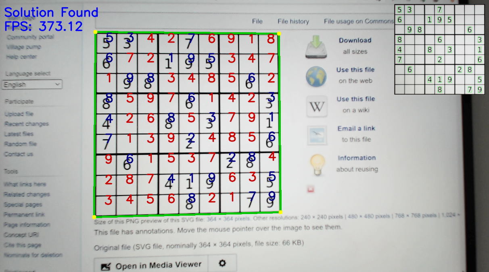

# Sudoku-RealTime

Solving the sudoku board in real-time from a static image or from a camera stream:

#### Usage:

- _python3 sudoku.py --train_  - train the OCR model (in general not needed, the trained model is already included)
- _python3 sudoku.py sudoku1.png_  - recognise the image from a file
- _python3 sudoku.py_  - run a video stream

